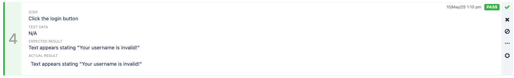

# 01 Manual Functional Testing

## User Login Functionality Module

### Test case document: 
https://docs.google.com/spreadsheets/d/1j36U6I9tZ9cvNaaWY6KU14cqM7nlknEDlMSAg855B80/edit?usp=sharing

### Test Scenario Outline:

Objective:
Verify that the login functionality works correctly under normal and edge-case conditions.

- Feature Under Test: User Login Functionality
- Module: Login Page
- Application Type: Web-based

### Notes on browser/environment setup:

Tested on MacOS Ventura 13.5.2 with Chrome Browser Version 135.0.7049.115 (Official Build) (x86_64)

### Testing and UI Behavior Screenshots:

Test Case Spreadsheet:

#### <u>TC-001</u>:
Test Result: Pass

Step 1: Navigate to Login Page:

Step 2: Enter a valid username:

Step 3: Enter a valid password:

Step 4: Click the login button:

Step 5: Verify the welcome message

#### <u>TC-002</u>:
Test Result: Pass

Step 1: Navigate to Login Page:

Step 2: Enter Invalid Username

Step 3: Enter Invalid Password

Step 4: Click the Login button

