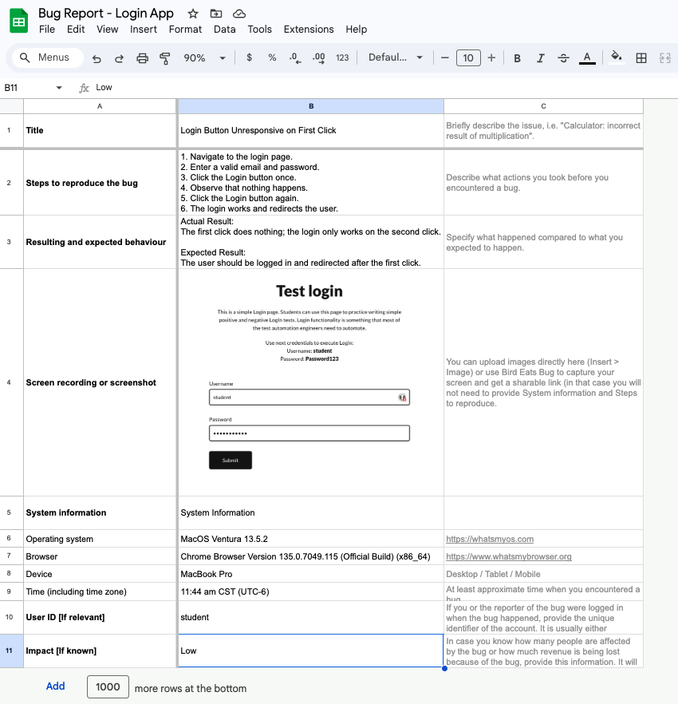
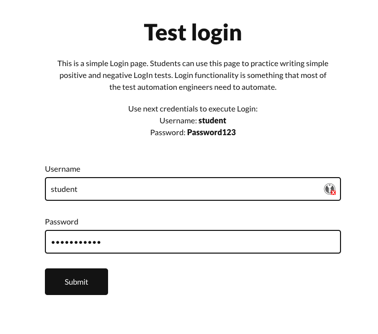

# 02 Bug Reporting

**Summary:** Login button does not respond on first click

**Steps to Reproduce:**
1. Go to login page
2. Enter username: student
3. Enter password: Student123
4. Click Login
5. Nothing happens
6. Click Login again
7. Login is successful

**Expected Result:** User should be logged in on first click.

**Actual Result:** Login works only after the second click.

**System Info:**
- OS: macOS Ventura 13.5
- Browser: Chrome 122.0
- Environment: Localhost
- App Version: v1.0

**Severity:** Medium  
**Priority:** High

**Attachments:** 

### Bug Report - Login App:
- [Google Sheets Bug Report - Login App](https://docs.google.com/spreadsheets/d/1kDRKsdBSCk5k941mgSmHAhQNc0gbiJTGhReE8OBuZlI/edit?gid=978824207#gid=978824207)



### Bug: 
When a user enters valid credentials and clicks the Login button, nothing happens on the first click. The second click processes the login as expected. 




A link to the buggy code:

```javascript
import { useState } from 'react';

export default function LoginApp() {
  const [username, setUsername] = useState('');
  const [password, setPassword] = useState('');
  const [error, setError] = useState('');
  const [loggedIn, setLoggedIn] = useState(false);
  const [clickCount, setClickCount] = useState(0); // Simulate login button needing 2 clicks

  const handleLogin = () => {
    setClickCount(prev => prev + 1);

    if (clickCount < 1) {
      // First click does nothing
      return;
    }

    if (username === 'student' && password === 'Student123') {
      setLoggedIn(true);
      setError('');
    } else {
      setError('Invalid credentials');
    }
  };

  if (loggedIn) {
    return (
      <div className="min-h-screen flex items-center justify-center bg-green-100">
        <h1 className="text-3xl font-bold text-green-800">Welcome, Student!</h1>
      </div>
    );
  }

  return (
    <div className="min-h-screen flex items-center justify-center bg-gray-100">
      <div className="bg-white shadow-md rounded px-8 pt-6 pb-8 mb-4 max-w-sm w-full">
        <h2 className="text-xl font-bold mb-4 text-center">Login</h2>
        <div className="mb-4">
          <label className="block text-gray-700 text-sm font-bold mb-2">Username</label>
          <input
            type="text"
            value={username}
            onChange={(e) => setUsername(e.target.value)}
            className="shadow appearance-none border rounded w-full py-2 px-3"
          />
        </div>
        <div className="mb-4">
          <label className="block text-gray-700 text-sm font-bold mb-2">Password</label>
          <input
            type="password"
            value={password}
            onChange={(e) => setPassword(e.target.value)}
            className="shadow appearance-none border rounded w-full py-2 px-3"
          />
        </div>
        {error && <p className="text-red-500 text-xs italic mb-4">{error}</p>}
        <button
          onClick={handleLogin}
          className="bg-blue-500 hover:bg-blue-700 text-white font-bold py-2 px-4 rounded w-full"
        >
          Login
        </button>
      </div>
    </div>
  );
}
```