# API Testing Report

- Project: Login API Functional 
- TestTester: Michael Stagg
- Date: 05/13/2025
- Environment: Localhost 
- (Mock API)Tool Used: Postman

### Objective:

To test the /api/login endpoint for expected responses under various input conditions including valid login, invalid credentials, missing parameters, and invalid content format.

### Summary of Test Results:

| Test Case ID | Description             | Result  | Notes                                  |
|--------------|-------------------------|---------|----------------------------------------|
| TC_API_001   | Valid login credentials |   Pass  | JWT token returned as expected         |
| TC_API_002   | Invalid credentials     |   Pass  | Error message returned with 401 status |
| TC_API_003   | Missing username        |   Pass  | Validation error with 400 status       |
| TC_API_004   | Missing password        |   Pass  | Validation error with 400 status       |
| TC_API_005   | Invalid content-type payload | Pass | Correctly rejected with 415 status   |

### Observations:

- API responds consistently with clear status codes.
- Proper validation is enforced for missing fields.
- JSON responses follow expected structure.
- Edge case handling appears robust.

### Conclusion:

The login API endpoint passes all manual functional test cases based on defined acceptance criteria. Additional testing such as rate limiting, throttling, and security testing (e.g., SQL injection) is recommended for future sprints.

All test case details are documented in the accompanying api-test-cases.xlsx file.

### Screenshots:

[API-Test-Cases Google Sheets](https://docs.google.com/spreadsheets/d/1DvsMG4NYRzxCh-bKf4uiy4GtvT83aG2ED6fZ2FM62Tk/edit?gid=395501021#gid=395501021)  

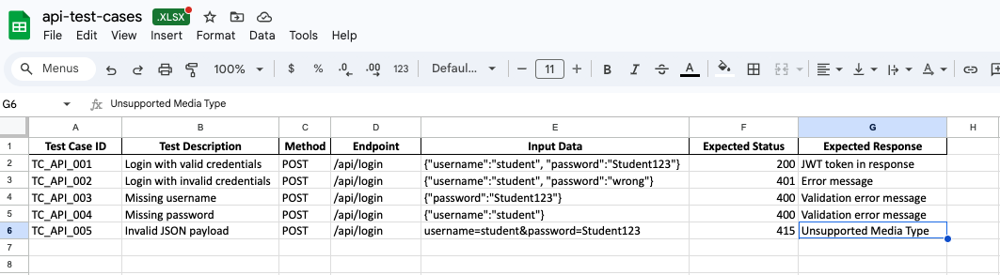

### TC-API-001:
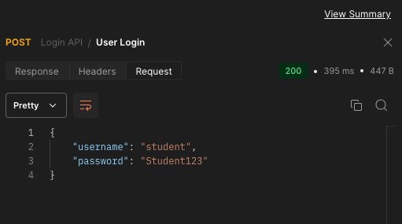
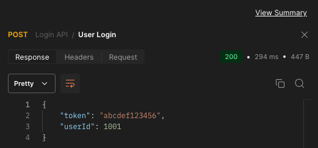

### TC-API-002:
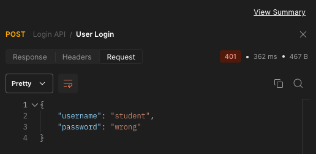
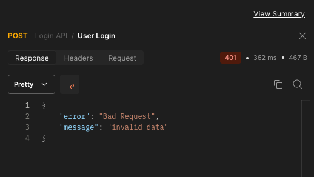

### TC-API-003:
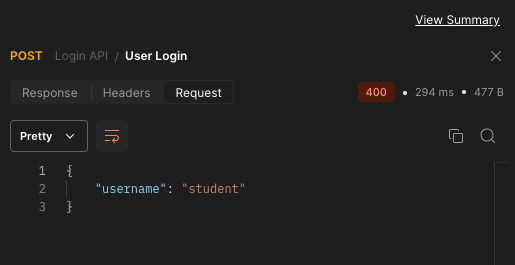
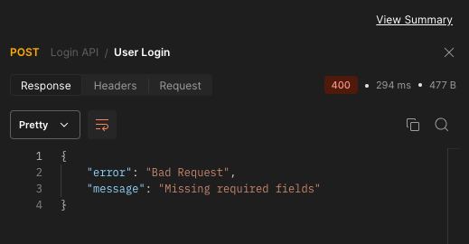

### TC-API-004:
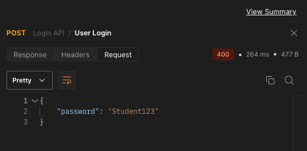
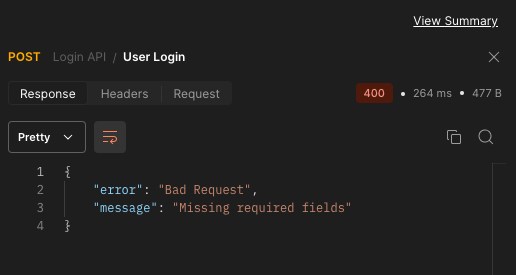

### TC-API-005:
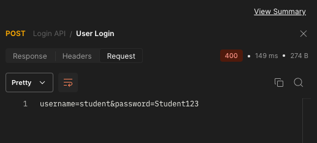
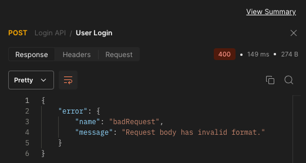

[README.md](README.md)