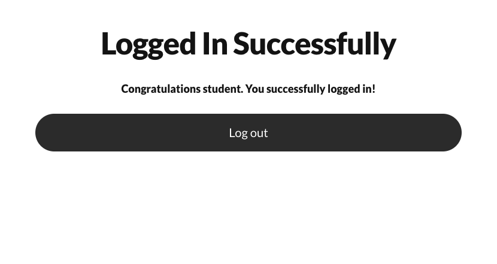

# Regression Test Summary and Analysis

- Module: Login App – Regression Testing (Module 5)
- Tester: Michael Stagg
- Environment: Localhost (Build v1.0.1)

### Test Results:
| Test Case                        | Before Change | After Change | Status      |
|----------------------------------|---------------|--------------|-------------|
| TC-001 – Navigate to Login Page  | ✅ Pass       | ✅ Pass       | ✅ Stable   |
| TC-002 – Valid Login             | ✅ Pass       | ✅ Pass       | ✅ Stable   |
| TC-003 – Invalid Login           | ✅ Pass       | ✅ Pass       | ✅ Stable   |
| TC-004 – UI Error (double click) | ❌ Fail       | ✅ Fixed      | 🟢 Improved |
| TC-005 – Redirect to Dashboard   | ✅ Pass       | ✅ Pass       | ✅ Stable   |
| TC-006 – Invalid Login Error     | ✅ Pass       | ✅ Fixed      | ✅ Stable   |

[regression-test-cases Google Sheets](https://docs.google.com/spreadsheets/d/1f6G8Vs2PQDoA1QBrzgVc9sG2xB3foif3xQLsuCaF5Q0/edit?usp=sharing)

### Summary of Test Results:
- The regression testing confirms that the fix for the double-click login bug is successful. All core login behaviors remained stable, and no new issues were introduced. Screenshots are included for pre- and post-fix states.

### Analysis: 
- The regression test focused on the login functionality of the application following a fix for a bug where the login button required two clicks. Pre-fix testing confirmed that valid credentials worked, but the login only succeeded after a second click due to improper event binding.

- After the fix was deployed in build v1.0.1:

- The login button behavior was corrected (verified via test TC003)

- All related login behaviors remained stable

- No regressions or new issues were introduced

- Screenshots before and after the fix (see screenshots/ folder) visually confirm the behavioral change and successful redirect to the dashboard after a single login attempt.

- This regression cycle validates that the fix resolved the original bug without affecting other parts of the system.

### Conclusion: 
✅ The build is regression-safe and ready for release.

## Screenshots:

### Baseline Test:

TC-001: Navigate to Login Page (Pass)  
  

TC-002: Valid Login (Pass)  
  

TC-003: Invalid Login (Pass)   
  

TC-004: UI Error (double click) (Fail)  
  

TC-005: Redirect to Dashboard (Pass)   
  

TC-006: Invalid Login Error (Pass)  
  

### Regression Test:

TC-001: Navigate to Login Page (Pass)  
  

TC-002: Valid Login (Pass)  
  

TC-003: Invalid Login (Pass)   
  

TC-004: UI Error (double click) (Pass)  
  

TC-005: Redirect to Dashboard (Pass)   
  

TC-006: Invalid Login Error (Pass)  
 

[README.md](README.md)