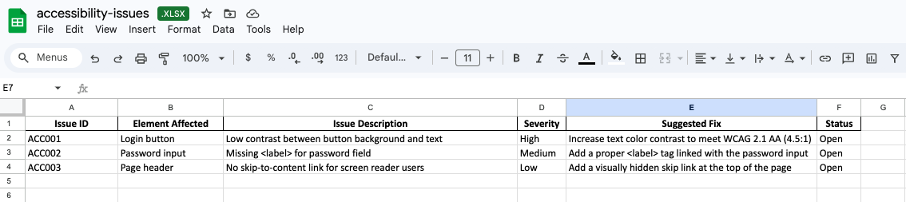
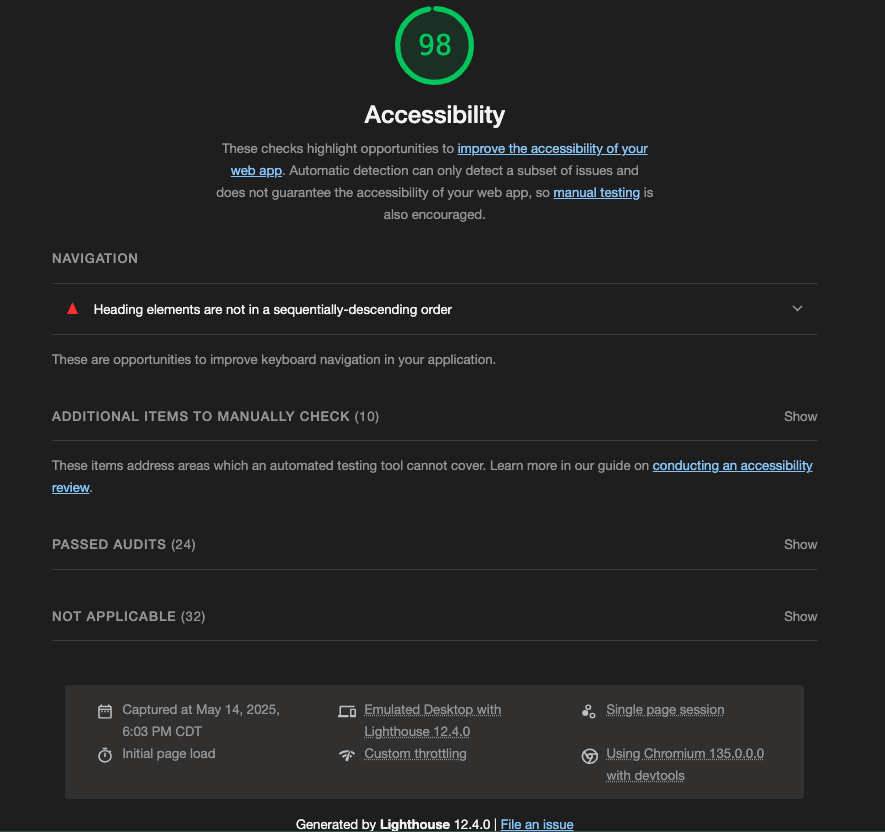

# Lighthouse Accessibility Audit – Login Page
  
**Tool:** Google Lighthouse – Chrome DevTools   
**Page Audited:** http://localhost:3000/login  
**Date:** 05/14/2025  
**Tester:** Michael Stagg   

## 🔍 Audit Score: 88/100

## ⚠️ Key Issues Identified
- Low contrast on login button text
- Missing `<label>` for the password input
- No skip-to-content link

## ✅ Passed Checks
- All buttons have discernible text
- Form fields use semantic HTML

## 🛠️ Recommendations
- Improve color contrast ratio on primary buttons
- Ensure all inputs have associated labels
- Add ARIA landmarks for easier screen reader navigation

## Spreadsheet
[acessibility-issues Google Sheets](https://docs.google.com/spreadsheets/d/1JlPV-jpF9DRYjVzbJe_aHCQuIUplBs_rmFm1lVDF3q8/edit?usp=sharing)  

## 📸 Screenshot
See `/screenshots/lighthouse-login.png` for full report

[README.md](README.md)